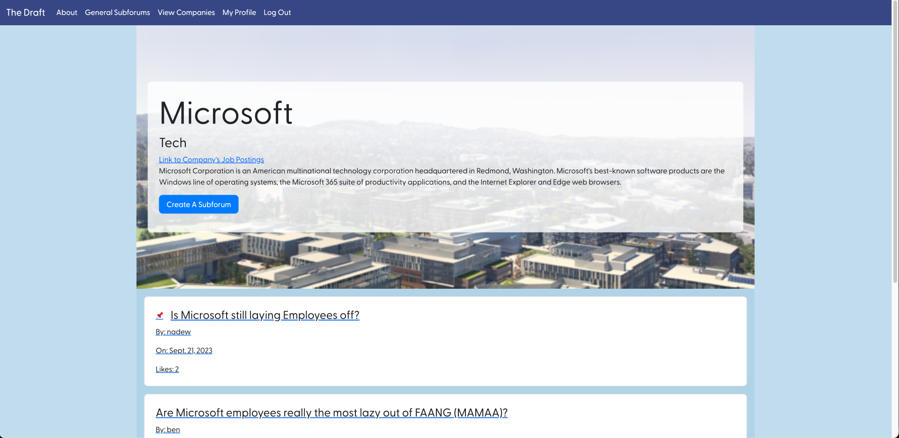
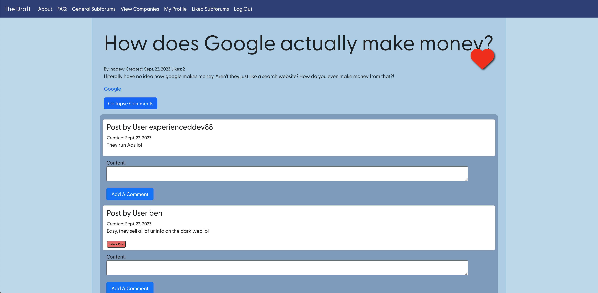
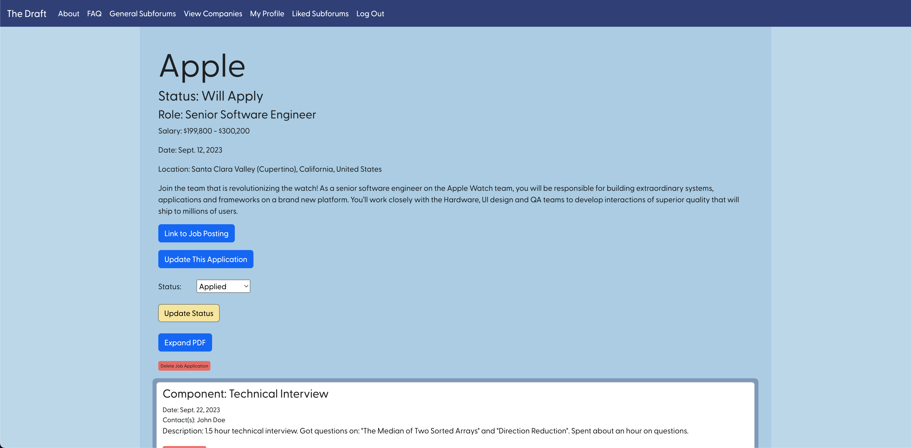

# The Draft

The Draft, created by developers Nadew Demissew, Ben Lee, and Jonathan Do, is a discussion forum connecting job-seekers and industry experts together to share knowledge, experiences, and insights with one another. The app can be considered analogous to the site CollegeConfidential.com as users generate discussion that helps everyone navigate the often complex and challenging world of job hunting. The app contains two major components that will hopefully give users the confidence and knowledge needed to succceed in their job search as well as the tools needed to stay organized throughout that process.

The first major component to The Draft app is the subforums feature, which is how users submit topics, questions, or any other kind of interesting content for other users to engage with. Subforms fall into two catergories: General subforums and Company subforums. General subforums are how users can submit content for discussion that is regarding a general topic of conversation relating to job-seeking. Alternatively, Company subforums are how users submit content related to job-searching or interesting info regarding a specific company. To access a Company's subforums, a user can click the "View Companies" tab on the nav bar and pick the specific company their interested in.

The second major component to The Draft App is it's job application tracker, which lives on the user's profile. The Job Application Tracker feature is designed to help users track a particular application cycle and provides a pdf viewer to show them what resume and/or cover letter was used, a status field that can be update to reflect where they currently are in the cycle, and additional data like application components and notes to help the user provided extra context and action items as needed. 

Our goals are to foster discussion, creativity, and community through this this and welcome all users to The Draft. Together, we'll make your job search more manageable, more successful, and even more enjoyable!

## Screenshots

 

 
 
 

## Technologies Used
- Python
- JavaScript
- HTML
- CSS
- Django
- Bootstrap
- AWS
- Heroku
- PDF.js

## Getting started
Click [here](https://thedraft-theebuggers-823b566ea1e8.herokuapp.com/) to access The Draft app.

## Next Step
There are many different features I think our entire team would love to implement. Having full CRUD on all of our data entities jumps to mind. Search queries is another feature we would love to have despite the challenges of searching across many data entities. Another feature that would be great to implement is the ability to hyperlink text sent by users in content boxes. Also, pagination is something that would not only improve user quality of life but also general usability of our app.  

